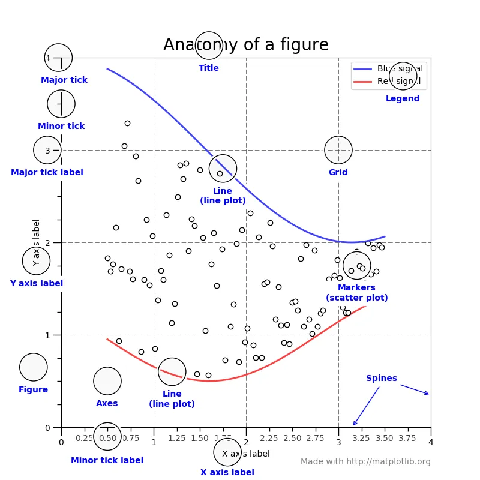
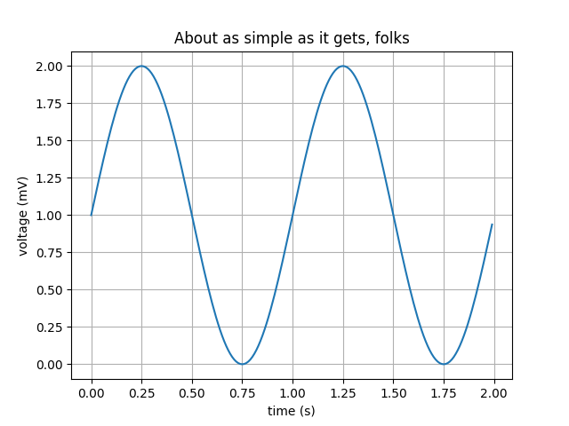
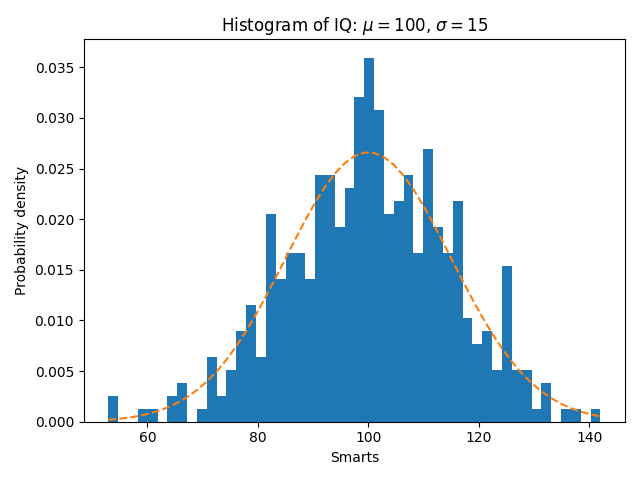
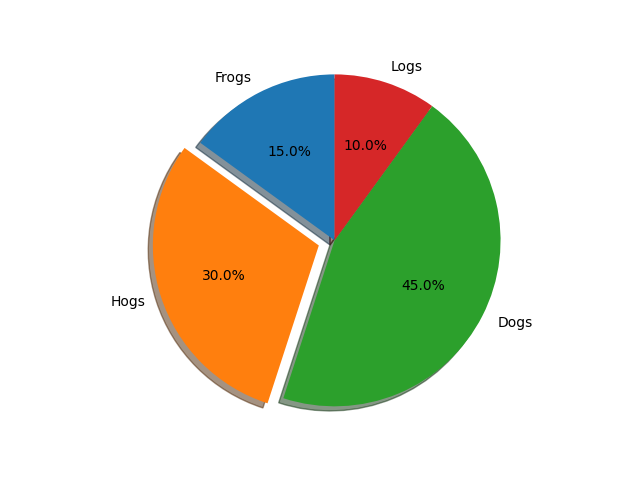
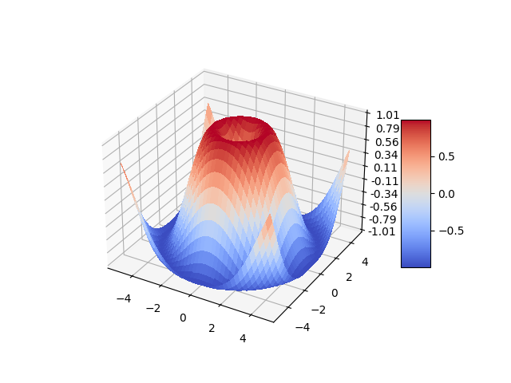

# matplotlib使用指南

## matplotlib介绍

Matplotlib 是 Python 的绘图库。 它可与 NumPy 一起使用 ，Matplotlib也是深度学习的常用绘图库，主要是将训练的成果进行图形化，因为这样更直观，更方便发现训练中的问题。

官网文档地址为：<https://matplotlib.org/stable/users/index>。

## matplotlib中的概念

下面这个官网的图可以很明显的看到一个图标中的基本元素。



- Figure(容器)：整个图像称为Figure， Figure用于保存返回的Axes(坐标域)， 一个Figure可以包含任意数量的Axes，可以理解为一个容器。
- Axes(坐标域)：可以将它理解为一个单个画板， 一个Axes包含两个Axis(坐标轴)(在3D图中为三个Axis), 每个Axes都有 一个 title(方法: set_title()), 一个x-label(方法: set_xlabel()), 一个y-label(方法: set_ylabel()).注意：一个给出的Axes对象只能包含在一个Figure中。
- Axis(坐标轴)：这是一种类似数轴的对象。可以通过Axis以及Axis的方法设置坐标轴上刻度的样式和坐标轴上的值。刻度的位置由Locater对象决定， 刻度对应的值由Formatter对象决定。

总结：Axes 差不多就是我们脑中所想的一个 ‘plot’。可以说就是单张纸。一个确定的figure当中可以有很多个Axes，但是一个确定的Axes只能在一个figure当中。

2维空间的Axes包含两个Axis（即x轴与y轴），3维空间的Axes包含三个Axis（即x轴，y轴和z轴）。这里注意区别Axes和Axis的概念。

Axis是一个数轴对象，它主要用于设置一个Axes里面的数据约束（即两个端点的值）和轴上的ticks（就是轴上的标记刻度）和tick-labels刻度的标签。

Subplot：子图，figure对象下创建一个或多个subplot对象(即axes)用于绘制图像。

- axes: 设置坐标轴边界和表面的颜色、坐标刻度值大小和网格的显示
- figure: 控制dpi、边界颜色、图形大小、和子区( subplot)设置
- font: 字体集（font family）、字体大小和样式设置
- grid: 设置网格颜色和线性
- legend: 设置图例和其中的文本的显示
- line: 设置线条（颜色、线型、宽度等）和标记
- patch: 是填充2D空间的图形对象，如多边形和圆。控制线宽、颜色和抗锯齿设置等。
- savefig: 可以对保存的图形进行单独设置。例如，设置渲染的文件的背景为白色。
- verbose: 设置matplotlib在执行期间信息输出，如silent、helpful、debug和debug-annoying。
- xticks和yticks: 为x,y轴的主刻度和次刻度设置颜色、大小、方向，以及标签大小。

## matplotlib常见图形绘制

### 线图line



```python 
import matplotlib.pyplot as plt
import numpy as np

# Data for plotting
t = np.arange(0.0, 2.0, 0.01)
s = 1 + np.sin(2 * np.pi * t)

fig, ax = plt.subplots()
ax.plot(t, s)

ax.set(xlabel='time (s)', ylabel='voltage (mV)',
       title='About as simple as it gets, folks')
ax.grid()

fig.savefig("test.png")
plt.show()
```

### 直方图hist



```python
import numpy as np
import matplotlib.pyplot as plt

np.random.seed(19680801)

# example data
mu = 100  # mean of distribution
sigma = 15  # standard deviation of distribution
x = mu + sigma * np.random.randn(437)

num_bins = 50

fig, ax = plt.subplots()

# the histogram of the data
n, bins, patches = ax.hist(x, num_bins, density=True)

# add a 'best fit' line
y = ((1 / (np.sqrt(2 * np.pi) * sigma)) *
     np.exp(-0.5 * (1 / sigma * (bins - mu))**2))
ax.plot(bins, y, '--')
ax.set_xlabel('Smarts')
ax.set_ylabel('Probability density')
ax.set_title(r'Histogram of IQ: $\mu=100$, $\sigma=15$')

# Tweak spacing to prevent clipping of ylabel
fig.tight_layout()
plt.show()
```

### 饼图pie



```python
import matplotlib.pyplot as plt

# Pie chart, where the slices will be ordered and plotted counter-clockwise:
labels = 'Frogs', 'Hogs', 'Dogs', 'Logs'
sizes = [15, 30, 45, 10]
explode = (0, 0.1, 0, 0)  # only "explode" the 2nd slice (i.e. 'Hogs')

fig1, ax1 = plt.subplots()
ax1.pie(sizes, explode=explode, labels=labels, autopct='%1.1f%%',
        shadow=True, startangle=90)
ax1.axis('equal')  # Equal aspect ratio ensures that pie is drawn as a circle.

plt.show()
```

### 3d 图形



```python
import matplotlib.pyplot as plt
from matplotlib import cm
from matplotlib.ticker import LinearLocator
import numpy as np

fig, ax = plt.subplots(subplot_kw={"projection": "3d"})

# Make data.
X = np.arange(-5, 5, 0.25)
Y = np.arange(-5, 5, 0.25)
X, Y = np.meshgrid(X, Y)
R = np.sqrt(X**2 + Y**2)
Z = np.sin(R)

# Plot the surface.
surf = ax.plot_surface(X, Y, Z, cmap=cm.coolwarm,
                       linewidth=0, antialiased=False)

# Customize the z axis.
ax.set_zlim(-1.01, 1.01)
ax.zaxis.set_major_locator(LinearLocator(10))
# A StrMethodFormatter is used automatically
ax.zaxis.set_major_formatter('{x:.02f}')

# Add a color bar which maps values to colors.
fig.colorbar(surf, shrink=0.5, aspect=5)

plt.show()

#使用numpy产生数据
x=np.arange(-5,5,0.1)
y=x*3

#创建窗口、子图
#方法1：先创建窗口，再创建子图。（一定绘制）
fig = plt.figure(num=1, figsize=(15, 8),dpi=80)     #开启一个窗口，同时设置大小，分辨率
ax1 = fig.add_subplot(2,1,1)  #通过fig添加子图，参数：行数，列数，第几个。
ax2 = fig.add_subplot(2,1,2)  #通过fig添加子图，参数：行数，列数，第几个。
print(fig,ax1,ax2)
#方法2：一次性创建窗口和多个子图。（空白不绘制）
fig,axarr = plt.subplots(4,1)  #开一个新窗口，并添加4个子图，返回子图数组
ax1 = axarr[0]    #通过子图数组获取一个子图
print(fig,ax1)
#方法3：一次性创建窗口和一个子图。（空白不绘制）
ax1 = plt.subplot(1,1,1,facecolor='white')      #开一个新窗口，创建1个子图。facecolor设置背景颜色
print(ax1)
#获取对窗口的引用，适用于上面三种方法
# fig = plt.gcf()   #获得当前figure
# fig=ax1.figure   #获得指定子图所属窗口

# fig.subplots_adjust(left=0)                         #设置窗口左内边距为0，即左边留白为0。

#设置子图的基本元素
ax1.set_title('python-drawing')            #设置图体，plt.title
ax1.set_xlabel('x-name')                    #设置x轴名称,plt.xlabel
ax1.set_ylabel('y-name')                    #设置y轴名称,plt.ylabel
plt.axis([-6,6,-10,10])                  #设置横纵坐标轴范围，这个在子图中被分解为下面两个函数
ax1.set_xlim(-5,5)                           #设置横轴范围，会覆盖上面的横坐标,plt.xlim
ax1.set_ylim(-10,10)                         #设置纵轴范围，会覆盖上面的纵坐标,plt.ylim

xmajorLocator = MultipleLocator(2)   #定义横向主刻度标签的刻度差为2的倍数。就是隔几个刻度才显示一个标签文本
ymajorLocator = MultipleLocator(3)   #定义纵向主刻度标签的刻度差为3的倍数。就是隔几个刻度才显示一个标签文本

ax1.xaxis.set_major_locator(xmajorLocator) #x轴 应用定义的横向主刻度格式。如果不应用将采用默认刻度格式
ax1.yaxis.set_major_locator(ymajorLocator) #y轴 应用定义的纵向主刻度格式。如果不应用将采用默认刻度格式

ax1.xaxis.grid(True, which='major')      #x坐标轴的网格使用定义的主刻度格式
ax1.yaxis.grid(True, which='major')      #x坐标轴的网格使用定义的主刻度格式

ax1.set_xticks([])     #去除坐标轴刻度
ax1.set_xticks((-5,-3,-1,1,3,5))  #设置坐标轴刻度
ax1.set_xticklabels(labels=['x1','x2','x3','x4','x5'],rotation=-30,fontsize='small')  #设置刻度的显示文本，rotation旋转角度，fontsize字体大小

plot1=ax1.plot(x,y,marker='o',color='g',label='legend1')   #点图：marker图标
plot2=ax1.plot(x,y,linestyle='--',alpha=0.5,color='r',label='legend2')   #线图：linestyle线性，alpha透明度，color颜色，label图例文本

ax1.legend(loc='upper left')            #显示图例,plt.legend()
ax1.text(2.8, 7, r'y=3*x')                #指定位置显示文字,plt.text()
ax1.annotate('important point', xy=(2, 6), xytext=(3, 1.5),  #添加标注，参数：注释文本、指向点、文字位置、箭头属性
            arrowprops=dict(facecolor='black', shrink=0.05),
            )
#显示网格。which参数的值为major(只绘制大刻度)、minor(只绘制小刻度)、both，默认值为major。axis为'x','y','both'
ax1.grid(b=True,which='major',axis='both',alpha= 0.5,color='skyblue',linestyle='--',linewidth=2)

axes1 = plt.axes([.2, .3, .1, .1], facecolor='y')       #在当前窗口添加一个子图，rect=[左, 下, 宽, 高]，是使用的绝对布局，不和以存在窗口挤占空间
axes1.plot(x,y)  #在子图上画图
plt.savefig('aa.jpg',dpi=400,bbox_inches='tight')   #savefig保存图片，dpi分辨率，bbox_inches子图周边白色空间的大小
plt.show()    #打开窗口，对于方法1创建在窗口一定绘制，对于方法2方法3创建的窗口，若坐标系全部空白，则不绘制
```
